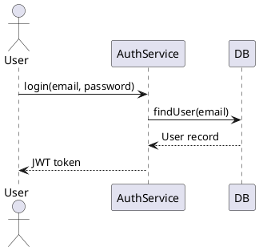
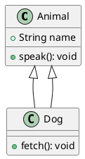
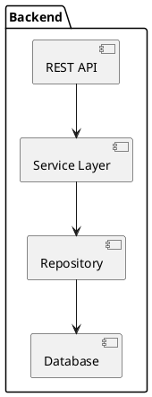
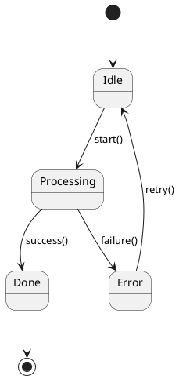
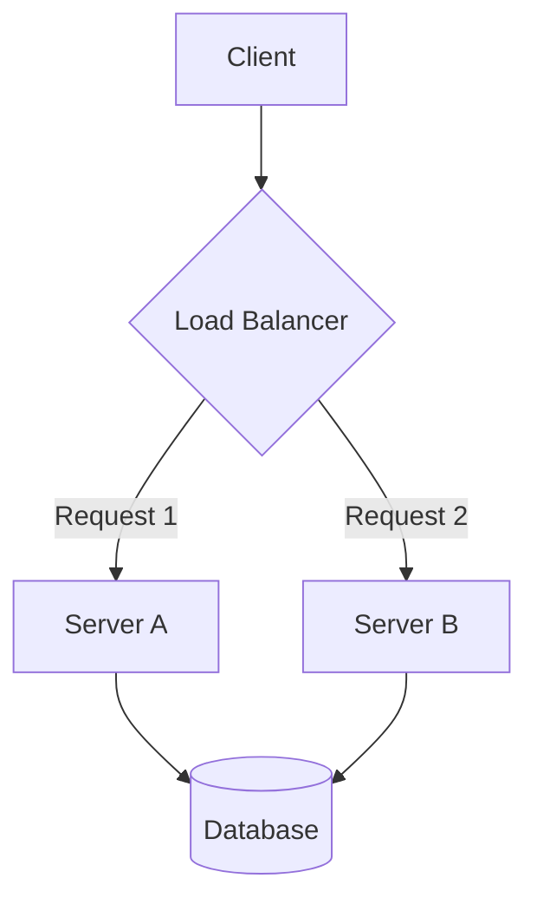
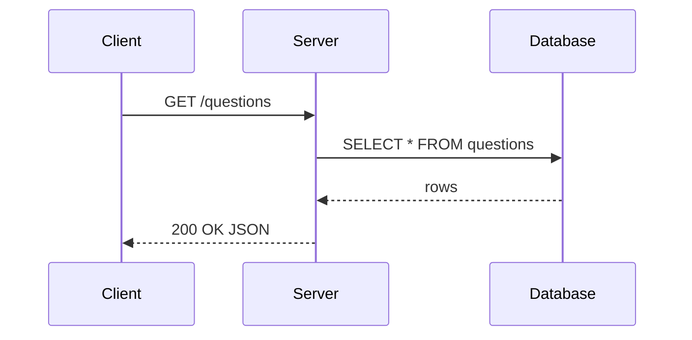
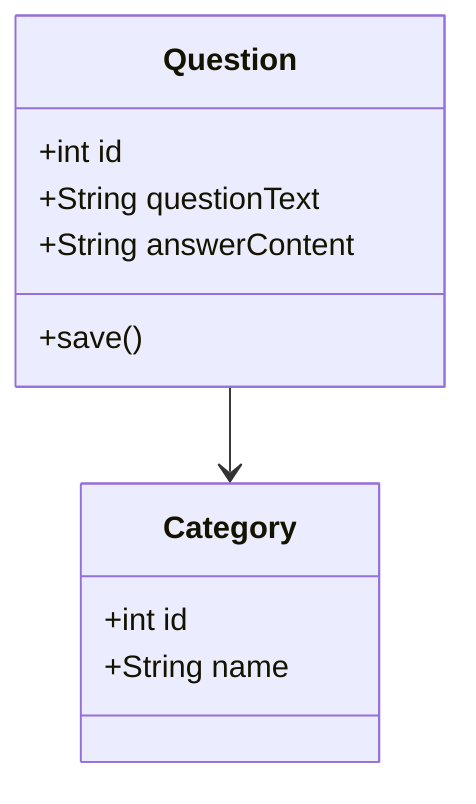
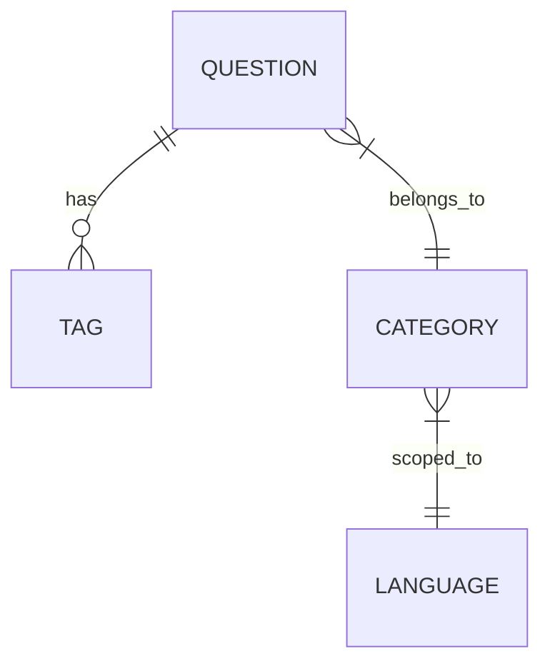

# Tech Interview Helper — UI (tih-ui)

A React + TypeScript single-page application for browsing, searching, and managing tech interview questions. It
communicates with the [tih-app](../tih-app) backend REST API.

---

## Table of Contents

- [Overview](#overview)
- [Tech Stack](#tech-stack)
- [Project Structure](#project-structure)
- [Requirements](#requirements)
- [Getting Started](#getting-started)
- [Available Scripts](#available-scripts)
- [Backend Proxy](#backend-proxy)
- [Pages & Routing](#pages--routing)

---

## Overview

|                  |                         |
|------------------|-------------------------|
| Dev server       | `http://localhost:5173` |
| API proxy target | `http://localhost:8080` |

Core features:

- **Search & filter** — full-text search across questions with language and category filters
- **Question detail** — view richly formatted question answers with syntax-highlighted code blocks and rendered diagrams
- **Create / Edit** — write and update questions using a rich-text editor (bold, italic, underline, highlight, colour,
  tables)
- **Diagram support** — embed PlantUML and Mermaid diagrams directly in answers using fenced code blocks
- **Batch upload** — drag-and-drop a JSON file to import multiple questions at once
- **Batch export** — download all (or filtered) questions as a portable JSON file

---

## Tech Stack

| Layer             | Technology                                                |
|-------------------|-----------------------------------------------------------|
| Language          | TypeScript 5.7                                            |
| UI library        | React 18                                                  |
| Build tool        | Vite 6                                                    |
| Styling           | Tailwind CSS 3.4                                          |
| Routing           | React Router DOM v6                                       |
| Server state      | TanStack React Query v5                                   |
| Client state      | Zustand v5                                                |
| HTTP client       | Axios                                                     |
| Rich-text editor  | TipTap v2                                                 |
| Diagram rendering | Mermaid v11 · PlantUML (server-rendered via plantuml.com) |
| Icons             | Lucide React                                              |
| File upload       | React Dropzone                                            |
| Linting           | ESLint + TypeScript ESLint                                |
| Formatting        | Prettier                                                  |

---

## Project Structure

```
src/
├── api/
│   ├── client.ts          # Axios instance (base URL /api/v1, error interceptor)
│   ├── categories.ts
│   ├── languages.ts
│   └── questions.ts
├── components/
│   ├── common/
│   │   ├── BatchUpload.tsx   # Drag-and-drop JSON import
│   │   └── FilterPanel.tsx   # Language / category filter sidebar
│   ├── editor/
│   │   ├── EditorToolbar.tsx
│   │   └── RichTextEditor.tsx
│   ├── layout/
│   │   ├── Header.tsx
│   │   └── Layout.tsx
│   ├── question/
│   │   ├── QuestionCard.tsx
│   │   └── QuestionForm.tsx
│   └── search/
│       ├── SearchBox.tsx
│       └── SearchResults.tsx
├── hooks/
│   ├── useDebounce.ts
│   └── useSearch.ts
├── pages/
│   ├── CreateQuestionPage.tsx
│   ├── EditQuestionPage.tsx
│   ├── QuestionDetailPage.tsx
│   └── SearchPage.tsx
├── store/
│   └── filterStore.ts     # Zustand store for active language / category filters
├── types/
│   └── index.ts
├── App.tsx
├── main.tsx
└── index.css
```

---

## Requirements

| Tool    | Minimum version |
|---------|-----------------|
| Node.js | 18              |
| npm     | 9               |

> The **[tih-app](../tih-app) backend must be running** on port `8080` before starting the dev server, otherwise all API
> calls will fail.  
> See the backend README for how to start it with Docker Compose.

---

## Getting Started

```bash
# 1. Install dependencies
npm install

# 2. Start the development server
npm run dev
```

The app will be available at **`http://localhost:5173`**.

To build for production:

```bash
npm run build        # type-check + bundle into dist/
npm run preview      # serve the production build locally
```

---

## Available Scripts

| Script            | Description                                                       |
|-------------------|-------------------------------------------------------------------|
| `npm run dev`     | Start the Vite dev server on port `5173` with HMR                 |
| `npm run build`   | Type-check with `tsc` then produce a production bundle in `dist/` |
| `npm run preview` | Serve the production build locally for testing                    |
| `npm run lint`    | Run ESLint across all `.ts` / `.tsx` files                        |
| `npm run format`  | Auto-format all source files with Prettier                        |

---

## Backend Proxy

The Vite dev server is configured to proxy all `/api` requests to the backend, so no CORS setup is needed during
development:

```
Browser → http://localhost:5173/api/v1/...
            ↓ Vite proxy
         http://localhost:8080/api/v1/...
```

This is configured in `vite.config.ts`:

```ts
server: {
  port: 5173,
  proxy: {
    '/api': {
      target: 'http://localhost:8080',
      changeOrigin: true,
    },
  },
},
```

If the backend runs on a different port, update the `target` value in `vite.config.ts`.

---

## Diagram Support

Answers can contain rendered diagrams written in **PlantUML** (recommended) or **Mermaid** (beta).  
Diagrams are authored as fenced code blocks in the answer editor and rendered automatically on the detail page.

### Inserting a diagram

1. Open a question for editing.
2. Click the **⬡ Diagram ▾** button in the toolbar.
3. Choose **PlantUML** (recommended) or **Mermaid** (beta).
4. A starter code block is inserted at the cursor. Edit the diagram code and save.

---

### PlantUML ✅ Recommended

PlantUML diagrams are rendered as SVG images via the [plantuml.com](https://www.plantuml.com) public server.  
The diagram code is encoded client-side — no backend changes required.

**Syntax reference:** https://plantuml.com/

Use the ` ```plantuml ` or ` ```puml ` language tag.

#### Sequence diagram



#### Class diagram



#### Component diagram



#### State diagram



---

### Mermaid ⚠️ Beta

Mermaid diagrams are rendered fully **in-browser** using the [mermaid](https://mermaid.js.org) library.  
The diagram size is automatically computed from the SVG's natural dimensions — small diagrams are scaled up for
readability, large ones fill the container.

> **Note:** Mermaid support is considered **beta**. For production content, prefer PlantUML.

**Syntax reference:** https://mermaid.js.org/intro/

Use the ` ```mermaid ` language tag.

#### Flowchart



#### Sequence diagram



#### Class diagram



#### Entity-relationship diagram



---

### Diagram size behaviour (Mermaid)

The Mermaid renderer automatically picks a display width based on the diagram's natural SVG dimensions relative to the
card width:

| Diagram natural width | Display width |
|-----------------------|---------------|
| ≥ 85 % of card        | 100 %         |
| 55 – 85 %             | 90 %          |
| 35 – 55 %             | 75 %          |
| 15 – 35 %             | 60 %          |
| < 15 %                | 50 %          |

All diagrams are horizontally centered and the card uses `overflow-x: auto` so very wide diagrams scroll rather than
clip.

---

## Pages & Routing

| Path                  | Page                 | Description                                        |
|-----------------------|----------------------|----------------------------------------------------|
| `/`                   | —                    | Redirects to `/search`                             |
| `/search`             | `SearchPage`         | Browse and full-text search questions with filters |
| `/questions/new`      | `CreateQuestionPage` | Create a new question                              |
| `/questions/:id`      | `QuestionDetailPage` | View a single question and its answer              |
| `/questions/:id/edit` | `EditQuestionPage`   | Edit an existing question                          |
